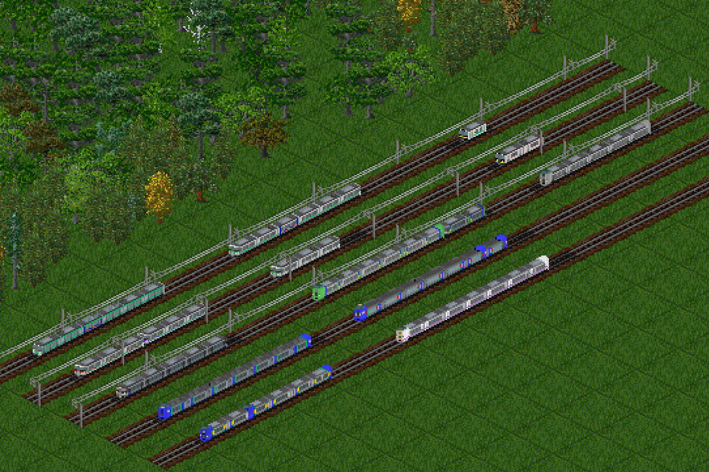
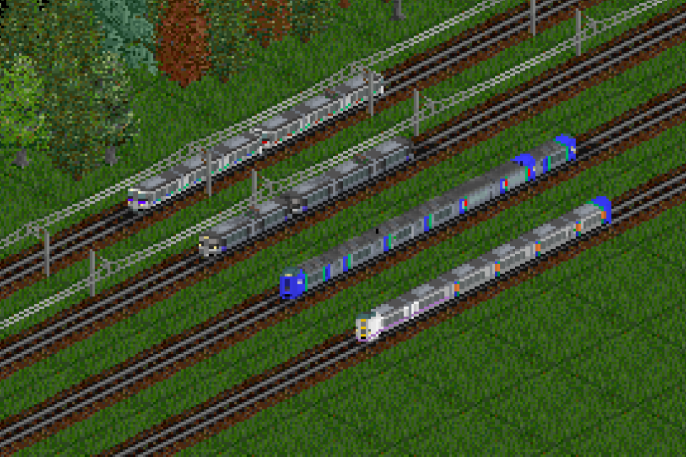

# HokkaidoTrains
This NewGRF adding characteristic vehicles of Hokkaido to OpenTTD games!

## Features
- Various colour variations 
- Variable capacity of vehicles and cargo decay speed
- Can faithfully reproduce actual train formations
<!--  -->

<!-- ## Usage -->
<!-- - Easily ways

- Faithfully ways -->

## Vehicles
### Diesel trains
- 261-0 series(Express train)
- 261-1000 series(Express train)
- 281 series(Express train)
- 283 series(Express train)
- 201 series(Commuter train)
- H100 series(Suburban train)

### Electric trains
- 785 series(Express train)
- 789-0 series(Express train)
- 789-1000 series(Express train)
- 721 series(Commuter train)
- 731 series(Commuter train)
- 733 series(Commuter train)
- 735 series(Commuter train)
- 737 series(Commuter train)

<!-- ## Compatible
### Tracks
- Vanilla Tracks
- Japan set 3 Tracks  -->

## Credits
Coding: nanasusu\
Graphics: nanasusu\
Special thanks: JP+ Team, Japanset3 Team
